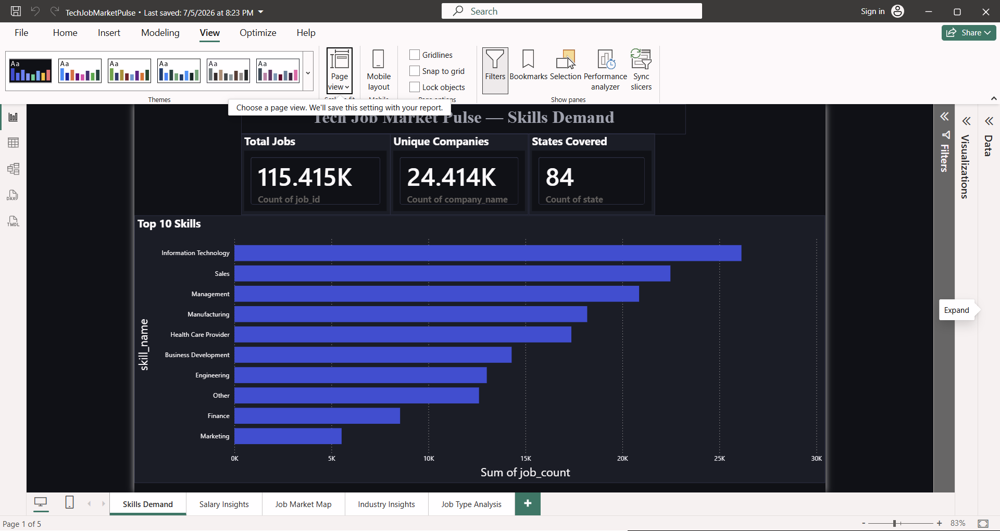
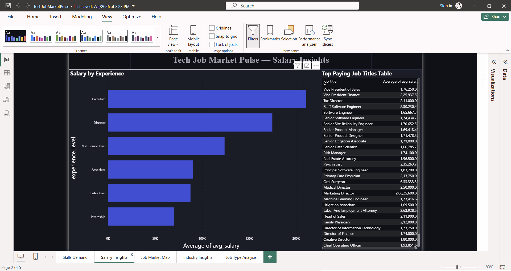
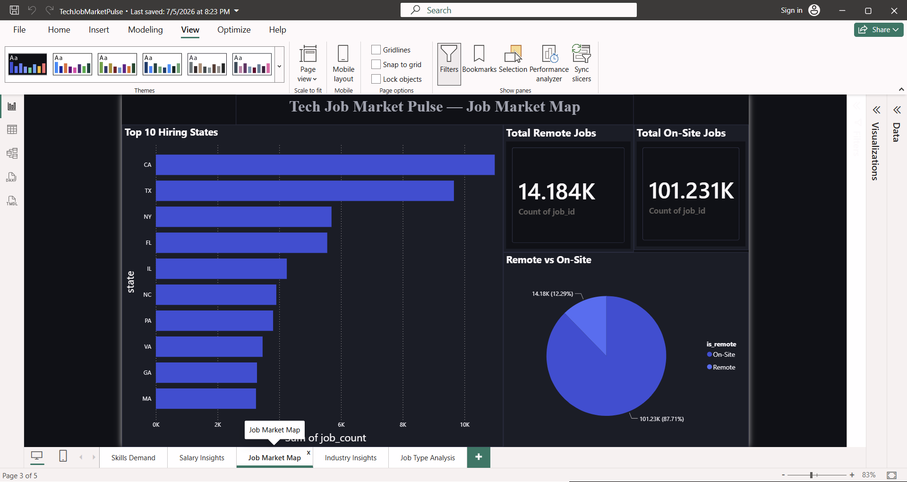
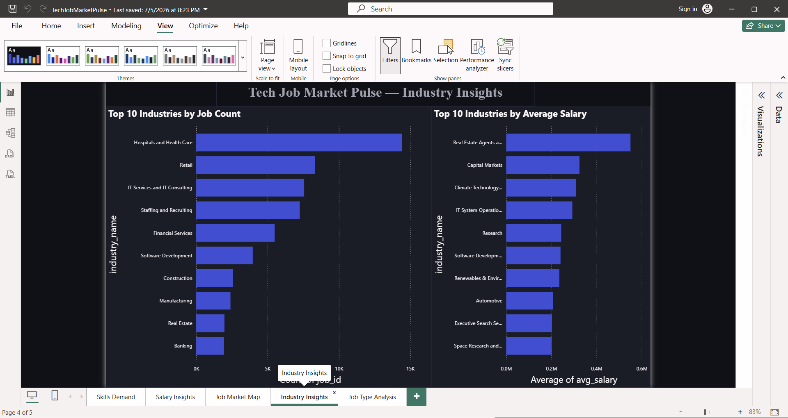
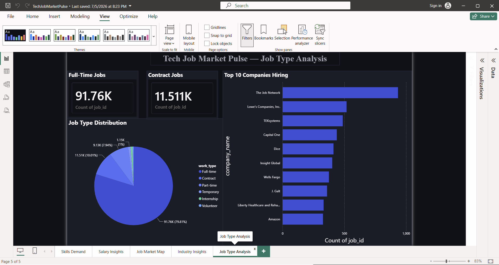

<div align="center">

# 🚀 Tech Job Market Pulse
### Turning 115,415 Real LinkedIn Job Postings into Actionable Career Insights


</div>

---

## 📖 Table of Contents
- [Problem Statement](#-problem-statement)
- [Dashboard Preview](#-dashboard-preview)
- [Project Architecture](#-project-architecture)
- [My Contributions](#-my-contributions)
- [Skills Demonstrated](#-skills-demonstrated)
- [Dataset](#-dataset)
- [Data Cleaning Steps](#-data-cleaning-steps)
- [Business Questions Answered](#-business-questions-answered)
- [Key Insights](#-key-insights-discovered)
- [SQL Analysis](#%EF%B8%8F-sql-analysis)
- [Python Visualizations](#-python-visualizations)
- [Power BI Dashboard](#-power-bi-dashboard--5-pages)
- [Project Metrics](#-project-metrics)
- [Challenges Faced](#-challenges-faced)
- [What I Learned](#-what-i-learned)
- [How to Run](#%EF%B8%8F-how-to-run)
- [Upcoming Features](#-upcoming-features-version-20)
- [Contact](#-contact)

---

## 📌 Problem Statement

Every year, thousands of freshers and job seekers apply blindly — without knowing:
- Which skills are **actually** in demand?
- Which roles pay the **highest salaries**?
- Which cities/states have the **most opportunities**?
- Is **remote work** really available, or just a myth?

**Tech Job Market Pulse** answers these questions using 115,415 real LinkedIn job postings — replacing guesswork with data.

---

## 🖼️ Dashboard Preview

> 📸 *Screenshots below — add your own by following the steps in the [How to Add Screenshots](#-how-to-add-screenshots-later) section.*

| Skills Demand | Salary Insights |
|---|---|
|  |  |

| Job Market Map | Industry Insights |
|---|---|
|  |  |

| Job Type Analysis |
|---|
|  |

---

## 🏗️ Project Architecture

```
                    LinkedIn Dataset (Kaggle)
                     123,849 raw records
                             │
              ┌──────────────┴──────────────┐
              │                              │
        SQL Cleaning                  Python Cleaning
     (SSMS — 5 queries)              (Pandas — merging
                                       6 datasets)
              │                              │
              └──────────────┬───────────────┘
                             │
                  Clean Master Dataset
                   115,415 records
                             │
                Exploratory Data Analysis
                (Matplotlib + Seaborn — 5 charts)
                             │
                   Power BI Dashboard
                     (5 interactive pages)
                             │
                AI Insight Engine (Planned)
                  Claude API — in progress
```

---

## 👤 My Contributions

This project was built end-to-end by me, from raw data to dashboard:

- ✔ Cleaned 123,849 raw job records down to 115,415 quality rows
- ✔ Merged 6 separate datasets (postings, skills, salaries, companies, industries, mappings)
- ✔ Designed a 5-query SQL cleaning & analysis pipeline in SQL Server
- ✔ Built reusable Python scripts for cleaning and visualization
- ✔ Created a 5-page interactive Power BI dashboard
- ✔ Designed a custom dark theme (JSON) applied across all dashboard pages
- ✔ Translated raw numbers into 8 business-relevant insights
- ✔ Wrote the foundation for an AI insight generator (`ai_insights.py`) using the Claude API

---

## 🧠 Skills Demonstrated

`Data Cleaning` · `ETL` · `SQL` · `Aggregations & Grouping` · `Joins` ·
`Exploratory Data Analysis` · `Data Visualization` · `Dashboard Design` ·
`Power BI` · `Data Modeling` · `Business Intelligence` · `Data Storytelling` ·
`KPI Analysis` · `Python (Pandas, Matplotlib, Seaborn)` · `API Integration`

---

## 📊 Dataset

- **Source:** [LinkedIn Job Postings — Kaggle](https://www.kaggle.com/datasets/arshkon/linkedin-job-postings)
- **Raw size:** 123,849 job postings across 6 CSV files
- **Files used:** `postings.csv`, `job_skills.csv`, `skills.csv`, `salaries.csv`, `companies.csv`, `job_industries.csv`
- **After cleaning:** 115,415 quality records

> ⚠️ **Scope note:** All insights below are derived from this specific LinkedIn dataset (a snapshot in time), not the entire U.S. job market. Figures should be read as *directional patterns within this dataset*, not universal labor market statistics.

---

## 🧹 Data Cleaning Steps

- ✓ Removed job postings with missing titles or company names
- ✓ Standardized experience level and work type columns
- ✓ Converted `remote_allowed` flags into readable Remote / On-Site labels
- ✓ Extracted state from raw, inconsistent location strings
- ✓ Removed duplicate job postings (same title + company + location)
- ✓ Merged skill abbreviations with their full skill names
- ✓ Joined industry codes with readable industry names
- ✓ Built a single master analytical table combining all 6 sources

---

## ❓ Business Questions Answered

- Which skills are most in demand across job postings?
- Which experience level offers the strongest salary growth?
- Which U.S. states have the highest concentration of hiring (in this dataset)?
- Which industries hire the most vs. which pay the most?
- What share of jobs are genuinely remote vs. on-site?
- What proportion of companies disclose salary information?
- Are full-time roles still the dominant job type?

---

## 💡 Key Insights Discovered

| # | Insight |
|---|---------|
| 1 | 🛠️ **Information Technology** is the top-demanded job **category** — appearing in 18,432 postings *(note: this reflects LinkedIn's broad job-function tagging, not a single technical skill like Python or SQL)* |
| 2 | 💰 **Executive-level roles** pay ~3x more than Entry Level ($196,770 vs $65,258 avg) |
| 3 | 📍 **California** has the highest job concentration in this dataset — more postings than TX, NY, and FL combined *(dataset-specific finding, not a national labor statistic)* |
| 4 | 🏥 **Healthcare** leads in hiring volume, but **Real Estate** and **Capital Markets** roles show the highest average salaries |
| 5 | 🏠 Only **12.29%** of postings are remote — 87.71% still require on-site presence |
| 6 | 📈 Moving from Entry to Mid-Senior level shows a **73% increase** in average salary |
| 7 | 💼 **79.81%** of postings are Full-Time positions |
| 8 | 🔒 **71%** of job postings in this dataset don't disclose salary information |

---

## 🗄️ SQL Analysis

5 analytical queries written in SQL Server Management Studio — see [`SQL_Cleaning_Queries.sql`](SQL_Cleaning_Queries.sql) for the full file.

**Example — Salary by Experience Level:**
```sql
SELECT
    formatted_experience_level       AS experience_level,
    COUNT(*)                         AS total_jobs,
    ROUND(AVG(normalized_salary), 0) AS avg_salary
FROM postings
WHERE normalized_salary IS NOT NULL
  AND formatted_experience_level IS NOT NULL
GROUP BY formatted_experience_level
ORDER BY avg_salary DESC;
```

**Other queries include:**
```
Query 1 → Missing value / data quality analysis
Query 2 → Cleaned master table creation
Query 3 → Top skills in demand (joined with skill mapping)
Query 4 → Salary by experience level
Query 5 → Top hiring states
```

---

## 📈 Python Visualizations

Generated using **Matplotlib & Seaborn** — see [`eda.py`](eda.py):

| Chart | Insight |
|---|---|
| Top 10 Skills Bar Chart | Most in-demand skills by job count |
| Salary by Experience Bar Chart | Salary progression across career levels |
| Remote vs On-Site Pie Chart | Work arrangement distribution |
| Top 10 States Bar Chart | Geographic hiring concentration |
| Salary Distribution Histogram | Overall salary spread with median line |

---

## 📊 Power BI Dashboard — 5 Pages

| Page | Content |
|------|---------|
| 🛠️ **Skills Demand** | Top 10 skills bar chart + 3 KPI cards (Total Jobs, Companies, States) |
| 💰 **Salary Insights** | Salary-by-experience chart + top-paying job titles table |
| 📍 **Job Market Map** | Top 10 hiring states + Remote vs On-Site pie chart |
| 🏭 **Industry Insights** | Top industries by job count vs. top industries by average salary |
| 💼 **Job Type Analysis** | Job type pie chart + top 10 hiring companies + Full-Time/Contract KPI cards |

**Power BI techniques used:** Clustered bar charts, Top N filtering, KPI cards, cross-filtering between visuals, custom dark theme (JSON), formatted tooltips.

---

## 📐 Project Metrics

| Metric | Value |
|---|---|
| Raw records | 123,849 |
| Cleaned records | 115,415 |
| Datasets merged | 6 |
| Dashboard pages | 5 |
| KPI cards | 7 |
| SQL queries | 5 |
| Python charts | 5 |
| Unique companies analyzed | 24,428 |
| U.S. states covered | 84 |

---

## 🧩 Challenges Faced

- The raw dataset (123,849 rows across 6 files) required careful joining without losing or duplicating records.
- Over **71%** of job postings had no salary data — required deciding what to filter vs. keep for non-salary analysis.
- Skills were stored as abbreviations in a separate table and had to be mapped to readable names before analysis.
- Location data was inconsistent (free text) and had to be parsed to extract usable state-level information.
- Balancing dashboard readability with a large number of skill/industry categories (using Top N filtering instead of showing all categories).

---

## 📚 What I Learned

- Writing SQL queries for data quality checks, cleaning, and aggregation
- Merging and reconciling multiple related datasets in Pandas
- Structuring a Python EDA-to-dashboard workflow
- Designing a multi-page Power BI dashboard with a consistent custom theme
- Converting open-ended business questions into concrete KPIs and visuals
- Handling API keys securely using environment variables (`.env` + `.gitignore`)

---

## ▶️ How to Run

### Prerequisites
```bash
pip install pandas openpyxl matplotlib seaborn python-dotenv
```

### Step 1 — Data Cleaning
```bash
python clean_data.py
```

### Step 2 — Python EDA
```bash
python eda.py
```

### Step 3 — Power BI Dashboard
Open `TechJobMarketPulse.pbix` in Power BI Desktop.

---

## 🖼️ How to Add Screenshots (Later)

1. Take a screenshot of each Power BI page (Snipping Tool or Win+Shift+S)
2. Create a folder named `screenshots` in your repository
3. Name the files exactly:
```
01_skills_demand.png
02_salary_insights.png
03_job_market_map.png
04_industry_insights.png
05_job_type_analysis.png
```
4. Upload them to the `screenshots/` folder on GitHub
5. They will automatically appear in the **Dashboard Preview** section above

---

## 🔮 Upcoming Features (Version 2.0)

| Feature | Description | Status |
|---|---|---|
| 🤖 **AI Insight Generator** | `ai_insights.py` is already built — it loads cleaned data, sends it to Claude AI (Anthropic API), and generates a formatted PDF report. Currently pending API credit activation. | 🔄 In Progress |
| 💬 **Interactive Chat** | Ask any question about the job market data in plain English | 📅 Planned |
| 🌐 **Web Deployment** | Deploy as a live Streamlit web app | 📅 Planned |
| 🇮🇳 **India Job Market Data** | Add Naukri/Indeed India data for local relevance | 📅 Planned |

> 💡 The `ai_insights.py` script in this repository is a working implementation — not a placeholder. It includes prompt design, secure API key handling via `.env`, and PDF generation logic using ReportLab.

---

## 📬 Contact

**Prachi Dixit**
- GitHub: [@PrachiDixit15](https://github.com/PrachiDixit15)
- LinkedIn: *Add your LinkedIn URL here*

---

<div align="center">

### ⭐ If you found this project helpful, please give it a star!

*Built with Python, SQL and Power BI*

</div>
